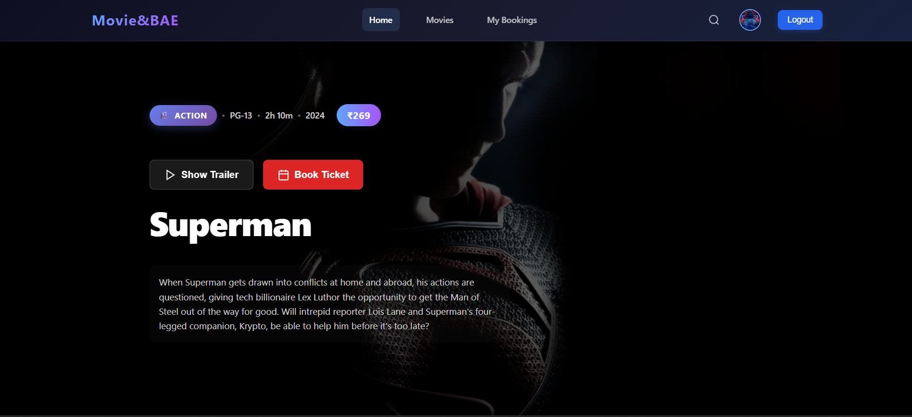
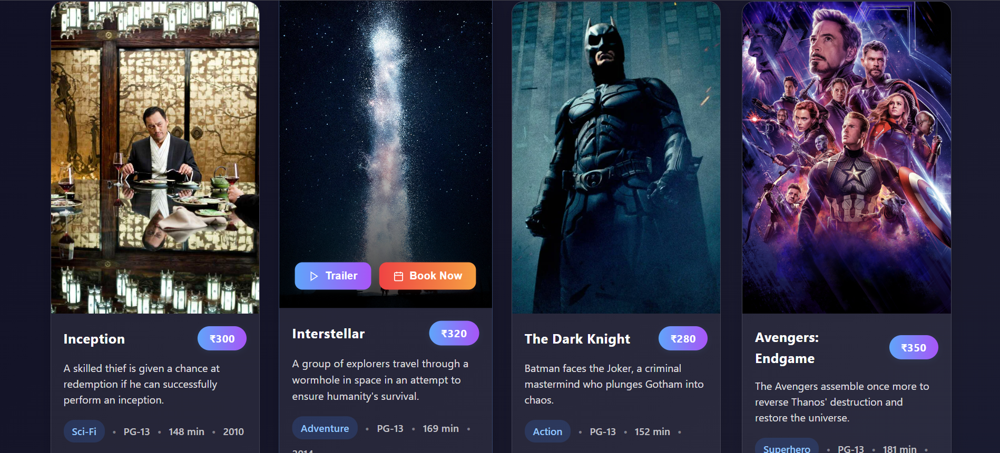
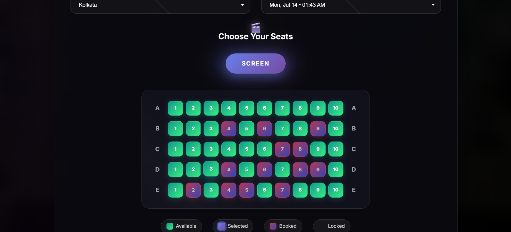
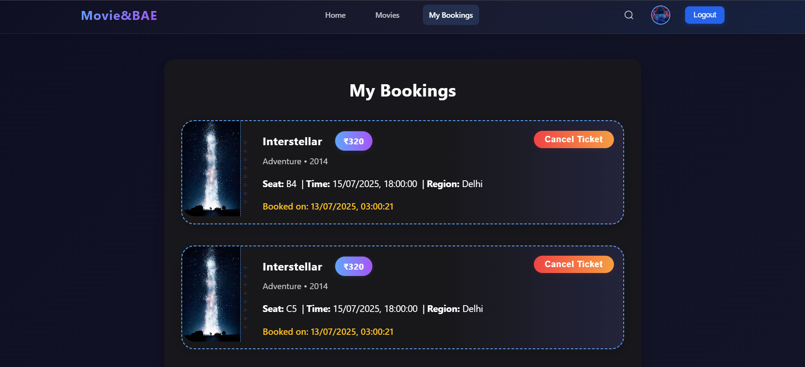
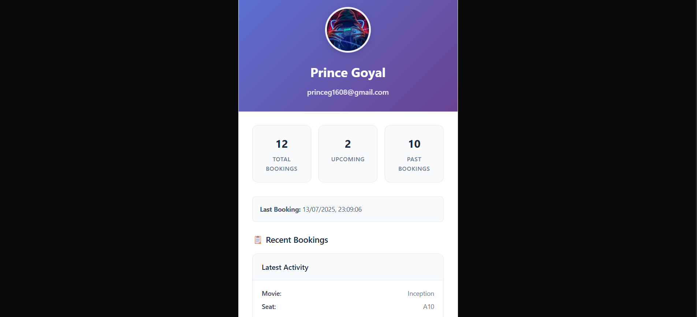
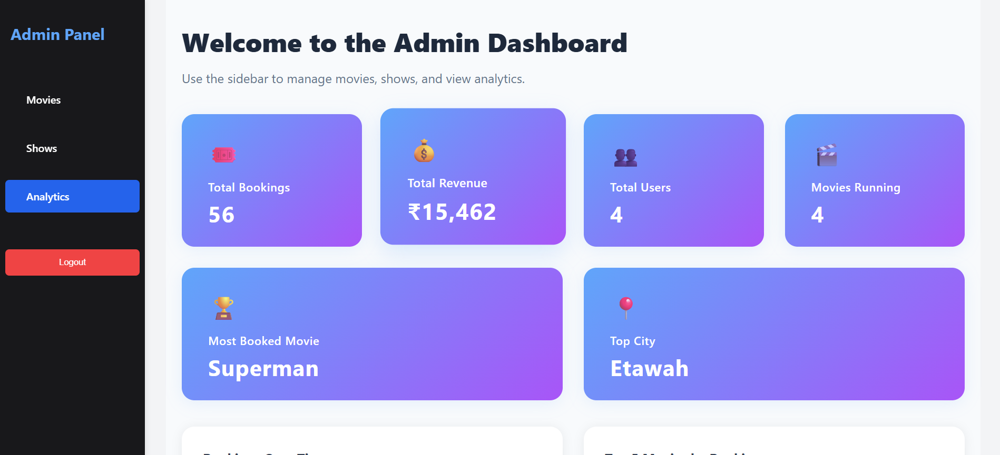
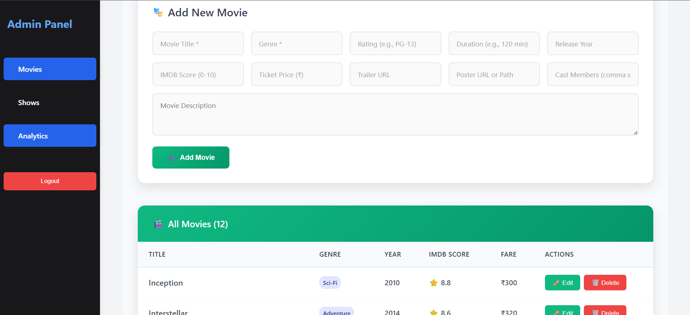
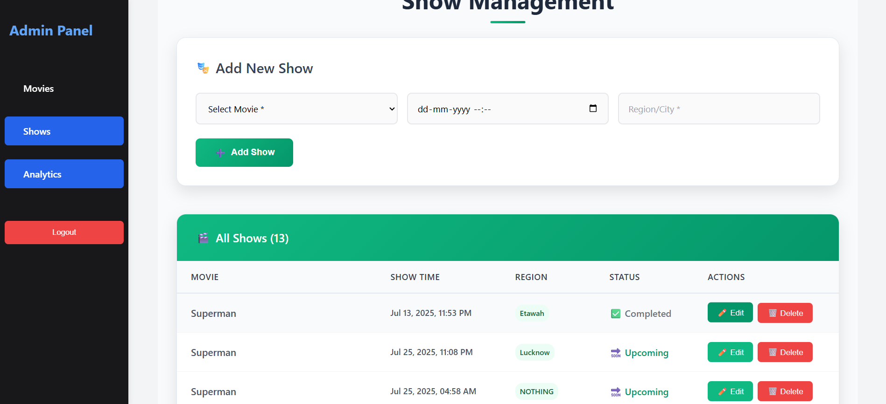
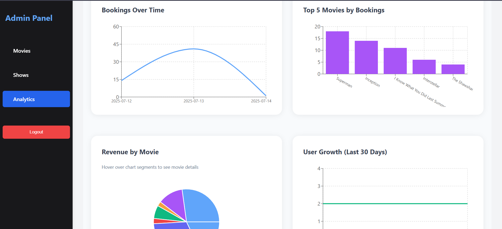

# MOVIE_BAE - (https://movie-bae-frontend.vercel.app/)

A full-stack movie ticket booking platform with real-time seat selection, user authentication (Google OAuth), admin analytics dashboard, and modern UI/UX. Built with React (frontend) and Node.js/Express/MongoDB along with socket.io (backend).

---

## Features

### User
- Browse movies, view details, and watch trailers
- Book tickets with real-time seat selection and locking
- Google Sign-In authentication
- View and manage your bookings (cancel upcoming tickets)
- Receive email confirmations for bookings and cancellations

### Admin
- Secure admin login (JWT-based)
- Add, edit, and delete movies and shows
- View analytics dashboard: bookings, revenue, user growth, top movies, and more
- Manage shows and movie listings

---

## Tech Stack
- **Frontend:** React, React Router, Context API, Recharts, Socket.io-client, Google OAuth
- **Backend:** Node.js, Express, MongoDB (Mongoose), JWT, Nodemailer, Socket.io
- **Email:** Gmail SMTP (Nodemailer)

---

## Project Structure

```
MOVIE_BAE/
  backend/      # Express API, MongoDB models, routes, admin logic
  frontend/     # React app, UI components, pages, context
```

---

## Getting Started

### Prerequisites
- Node.js (v16+ recommended)
- MongoDB Atlas account (or local MongoDB)
- Gmail account for email notifications (or update SMTP settings)

### 1. Clone the repository
```bash
git clone <https://github.com/i-amprince/Movie-Bae>
cd MOVIE_BAE
```

### 2. Backend Setup
```bash
cd backend
npm install
```

#### Environment Variables
Create a `.env` file in `backend/` with:
```
PORT=5000
JWT_SECRET=your_jwt_secret
EMAIL_USER=your_gmail@gmail.com
EMAIL_PASS=your_gmail_app_password
```
- For Gmail, create an [App Password](https://support.google.com/accounts/answer/185833) if 2FA is enabled.

#### Start Backend
```bash
npm start
```
- Server runs on [http://localhost:5000](http://localhost:5000)

### 3. Frontend Setup
```bash
cd ../frontend
npm install
npm start
```
- App runs on [http://localhost:3000](http://localhost:3000)

---

## Usage

### User
- Visit [http://localhost:3000](http://localhost:3000)
- Sign in with Google to book tickets
- Browse movies, select showtime, pick seats, and confirm booking
- View/cancel your bookings in "My Bookings"

### Admin
- Visit [http://localhost:3000/admin/login](http://localhost:3000/admin/login)
- Login with admin credentials (see below)
- Access dashboard, manage movies/shows, view analytics

#### Creating an Admin User
- Use the backend API: `POST /api/admin/create` with `{ "username": "admin", "password": "yourpassword" }`
- Or insert directly in MongoDB

---

## API Endpoints (Backend)
- `/api/movies` - CRUD for movies
- `/api/shows` - CRUD for shows
- `/api/bookings` - Book/cancel tickets, get user bookings
- `/api/users` - User upsert (Google login)
- `/api/admin/analytics/*` - Admin analytics endpoints

---

## Real-Time Features
- Seat selection/locking uses Socket.io for live updates
- Booking/cancellation events update all connected clients

---

## Environment & Customization
- Update MongoDB URI in `backend/server.js` as needed
- For production, set CORS and environment variables securely
- Email templates can be customized in `backend/utils/email.js`

---

## Screenshots

### Home Page


### Movies Section


### Book Ticket Flow


### My Bookings


### Profile Section


### Admin Dashboard


### Add Movie (Admin)


### Add Show (Admin)


### Analytics (Admin)


---

## License
MIT

---

## Credits
- [Create React App](https://create-react-app.dev/)
- [Recharts](https://recharts.org/)
- [Socket.io](https://socket.io/)
- [Google Identity Services](https://developers.google.com/identity)

---

## Contributing
Pull requests are welcome! For major changes, please open an issue first to discuss what you would like to change. 

---

## Local Development: API URLs & Environment Variables

**After recent updates, API and socket URLs in the frontend are now dynamic and use the `REACT_APP_API_URL` environment variable.**

### 1. Set Up Environment Variable for Localhost

In `frontend/.env` (create if it doesn't exist):
```
REACT_APP_API_URL=http://localhost:5000/api
```
- This ensures all API and socket requests from the React app go to your local backend.

### 2. Files Using the API URL
The following frontend files use the API URL dynamically:
- `src/socket.js`
- `src/pages/BookTicket.js`
- `src/pages/MovieDetails.js`
- `src/pages/MyBooking.js`
- `src/pages/UserProfile.js`
- `src/pages/MoviesPage.js`
- `src/pages/SignIn.js`
- `src/pages/MovieBookingLanding.js`
- `src/pages/admin/AdminMovies.js`
- `src/pages/admin/AdminShows.js`
- `src/pages/admin/AdminLogin.js`
- `src/pages/admin/AdminDashboardHome.js`

**No manual code changes are needed for local/production switching—just set the correct `REACT_APP_API_URL` in your `.env` file.**

### 3. Google OAuth (Sign In)
- Make sure your Google Cloud Console OAuth credentials have `http://localhost:3000` in the **Authorized JavaScript origins** for local development.
- For production, added the deployed frontend URL (e.g., `https://movie-bae-frontend.vercel.app`).

### 4. Backend
- The backend does not require changes for local/production switching, as long as the frontend points to the correct API URL.

--- 
